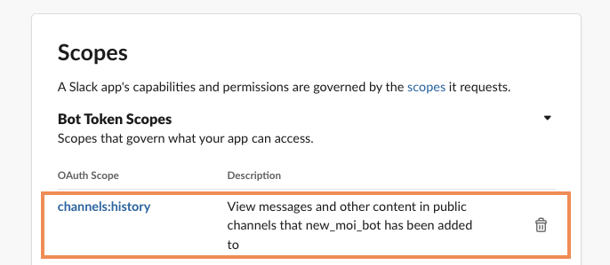
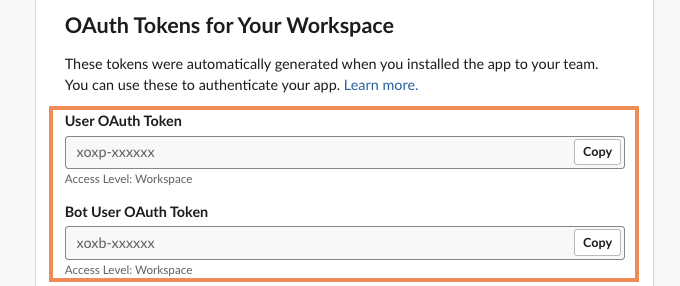
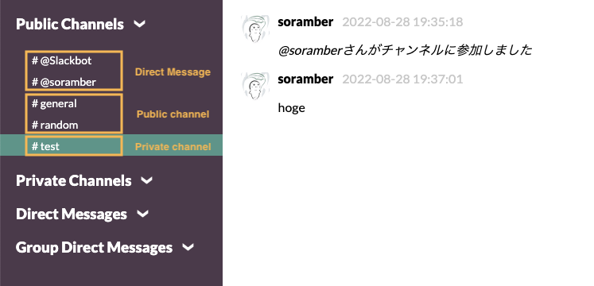

# Slack Data Export

This code exports messages of public channels, private channels, direct
messages and group messages, and downloads files exchanged in those at Slack.

## Requirements

- Python 3.2+
  - "requests" and "slack-sdk" modules
- Slack App's Token
  - https://api.slack.com/apps

A Slack app's token is tied to the required scope.

The required scopes to run this code is as follows:

- `channels:history`, `channels:read`
- `files:read`
- `groups:history`, `groups:read`
- `im:history`, `im:read`
- `mpim:history`, `mpim:read`
- `users:read`



## Usage

Rewrite the `USER_TOKEN` and `BOT_TOKEN` values in const.py to those of your
Slack app:

```python
USER_TOKEN = "xoxp-xxxxxx"  # Your User Token
BOT_TOKEN = "xoxb-xxxxxx"  # Your Bot Token
```



Install the external package:

```
$ pip install requests
$ pip install slack-sdk
```

And run main.py:

```
$ python main.py
```

Export messages and files in `EXPORT_BASE_PATH` as a zip file.

### Configuring

List of configuration values in const.py:

| Name                     | Type     | Description                                         |
| ------------------------ | -------- | --------------------------------------------------- |
| ACCESS_WAIT              | float    | Wait time (sec) for an API call or a file download. |
| EXPORT_BASE_PATH         | string   | Export directory path.                              |
| LOG_LEVEL                | function | Logging level of the logging module.                |
| REQUESTS_CONNECT_TIMEOUT | float    | Connect timeout (sec) for the requests module.      |
| REQUESTS_READ_TIMEOUT    | float    | Read timeout (sec) for the requests module.         |
| USE_USER_TOKEN           | boolean  | Whether or not to use the User Token.               |
| SPLIT_MESSAGE_FILES      | boolean  | Whether or not to split message files by day.       |

If change `ACCESS_WAIT`, check
[the rate limits](https://api.slack.com/docs/rate-limits) of Slack APIs.

## Cooperation

By loading the exported zip file into a viewer app such as [@hfaran](https://github.com/hfaran) 's [slack-export-viewer](https://github.com/hfaran/slack-export-viewer), you can view the messages.



Incidentally, since all conversations are displayed in the public channel column, this script appends "@" to the beginning of the user name in the case of DMs.
